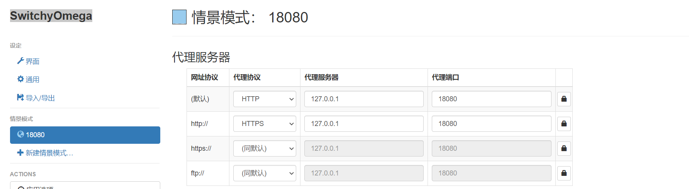

## HostPlus

只支持http映射,https只能转发,无法做映射

对比host文件外,支持一下三种映射(都可以带端口):
- ip到ip
- ip到域名
- 域名到域名

使用:
- chrome 里面下载`SwitchyOmega`,启动后添加代理端口和服务

- java代码如果有需要代理的,在启动项里面配置`-Dhttp.proxyHost=127.0.0.1 -Dhttp.proxyPort=18080`

生成证书
```shell
### 生成ca证书及秘钥:
openssl req -x509 -sha256 -days 1825 -newkey rsa:2048 -keyout rootCA.key -out rootCA.crt
### 将秘钥转换成pem格式:
openssl pkcs8 -topk8 -inform PEM -outform DER -in rootCA.key -out rootCA.der -nocrypt 
```
